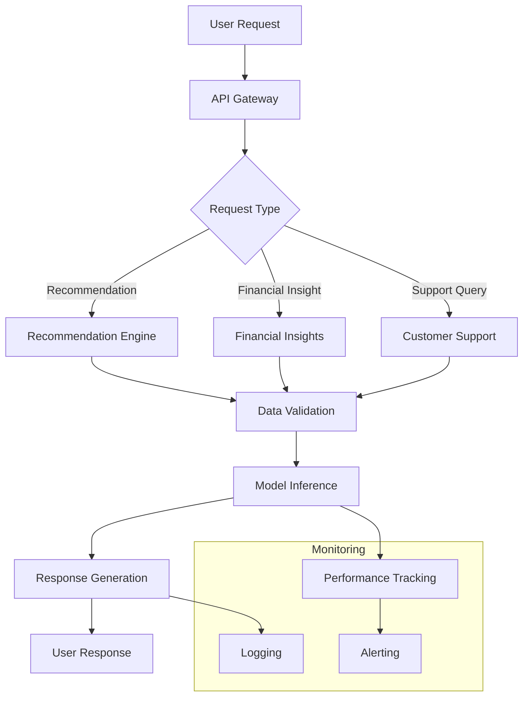

# Application Flow

## Overview
This document outlines the workflow of the AI-Powered Recommendation and Insights Platform. The flowchart below illustrates the key processes, decision points, and interactions between components.

## Key Stages

### 1. User Request
- The user sends a request to the platform via the API (e.g., for recommendations, financial insights, or customer support)

### 2. API Gateway
- The request is routed to the appropriate service (recommendation engine, financial insights, or customer support)
- Rate limiting and authentication are enforced

### 3. Data Validation
- The input data is validated to ensure it meets the required format and constraints

### 4. Model Inference
- The validated data is processed by the appropriate model
- The model generates a response based on the input

### 5. Response Generation
- The response is formatted and returned to the user

### 6. Monitoring
- The system continuously monitors performance and logs metrics for analysis
- Alerts are triggered for any anomalies or performance degradation