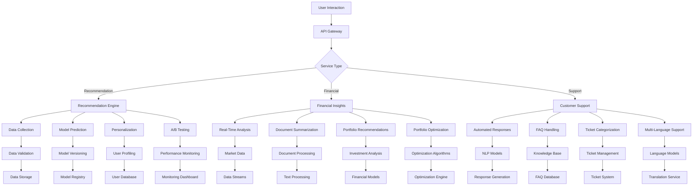

# Application Flow

## AI Platform Workflow Diagram

## Flow Explanation

### Recommendation Engine
1. **Data Collection**: Gathers user interaction data from various sources
2. **Model Prediction**: Uses hybrid models (collaborative + content-based filtering) for recommendations
3. **Personalization**: Tailors recommendations based on user profiles and preferences
4. **A/B Testing**: Continuously optimizes recommendation strategies

### Financial Insights
1. **Real-Time Analysis**: Processes market data streams for up-to-date insights
2. **Document Summarization**: Analyzes financial reports and news articles
3. **Portfolio Recommendations**: Provides personalized investment suggestions
4. **Portfolio Optimization**: Offers strategies for maximizing returns

### Customer Support
1. **Automated Responses**: Generates context-aware responses using NLP models
2. **FAQ Handling**: Efficiently addresses common questions from knowledge base
3. **Ticket Categorization**: Automatically routes and prioritizes support tickets
4. **Multi-Language Support**: Provides services in multiple languages

## Technology References
- **Data Processing**: Kafka/AWS Kinesis, Pandas, NumPy
- **Machine Learning**: PyTorch, HuggingFace Transformers
- **API Framework**: FastAPI
- **Monitoring**: Prometheus, Grafana
- **Database**: PostgreSQL, Redis

For more details on the technology stack, refer to [Tech Stack Documentation](Tech-stack.md)
